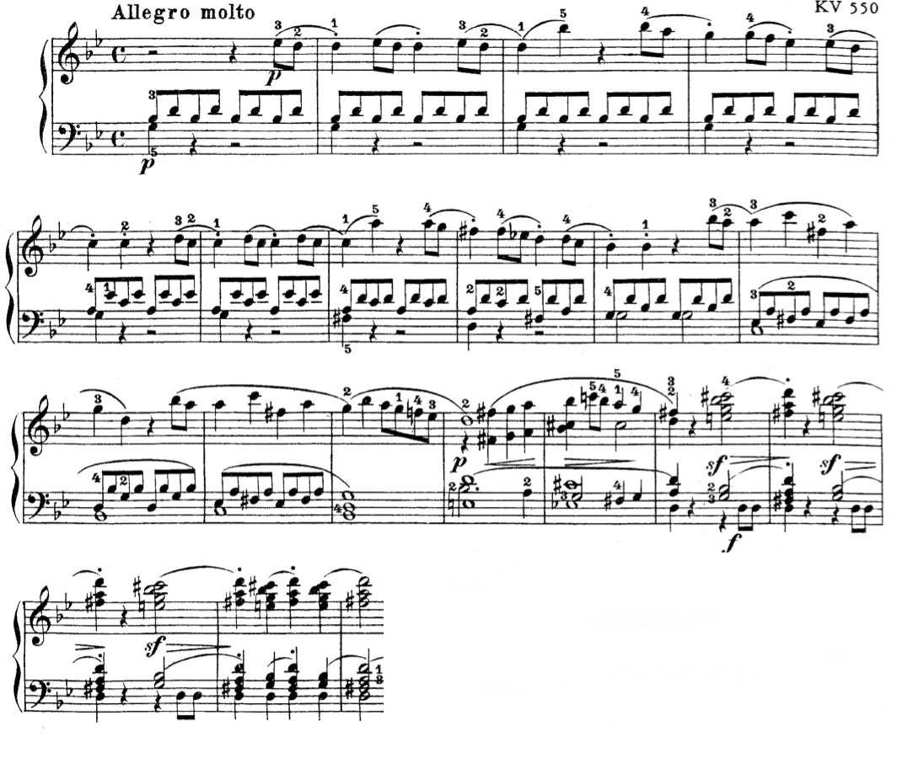

{{ page.title }}
================

Often, a theme is surrounded by material that exists outside its boundaries, but which is clearly dependent on the theme itself. This material is, as William Caplin has noted, “before-the-beginning,” an *introductory* *(prefix)* function or “after-the-end," a *post-cadential* *(suffix)* function 

## Introduction ##

An introduction is a short passage--perhaps just a single chord, or maybe a few measures--preceding a theme. Introductions lack distinct motivic material and/or a harmonic progression. Therefore, these passage seem connected to the following theme, but are not part of their initiating phrase. 

**Haydn, Symphony No. 101, "Clock"** 

<iframe src="https://embed.spotify.com/?uri=spotify:track:3JlbelZisTTwEh6e13uRyQ" width="300" height="80" frameborder="0" allowtransparency="true"></iframe> 

Here, a one-measure accompanimental introduction sits in front of a four-measure antecedent phrase, which begins in m. 2. This characteristic example lacks characteristic melodic interest—-in fact, there is no melody at all--and simply repeats a tonic chord.

##Post-Cadential Function##

The function of a post-cadential passage is described according to what kind of cadence—PAC or HC—ended the theme.

*Closing sections* follow themes that end PACs. They are variable in length—maybe as short as a single measure or as long as eight. A closing sections functions to confirm the PAC that ended the theme, perhaps centering melodic action around scale degree 1, prolonging tonic with a pedal, alternating tonic and dominant harmonies, or repeating a cadential progression.

<iframe src="https://embed.spotify.com/?uri=spotify:track:3ZlIXdp94i6qpfox8Su6Ll" width="300" height="80" frameborder="0" allowtransparency="true"></iframe> 

In this example (from Mozart's Piano Sonata, K. 330), a compound period initiates the theme and ends with a PAC in m. 16. Following the PAC, a five-measure *closing section* confirms the cadence. As the melody is centered around tonic, the ii–V-I cadential progression that ended the theme (see m. 15 and 16) is repeated.

When a closing section follows an HC, the dominant harmony is often prolonged, creating a post-cadential *standing on the dominant*.

<iframe src="https://embed.spotify.com/?uri=spotify:track:04zau0E0VspgiqNvTqCO7u" width="300" height="80" frameborder="0" allowtransparency="true"></iframe> 

This famous example (from the first movement of Mozart’s Symphony No. 40) begins with a one-measure introduction followed a compound sentence. This compound sentence ends with a half cadence in m. 16. (Notice the augmented sixth chord that precedes it.) The following six measures *stand on the dominant,* prolonging the cadence by emphasizing dominant harmony with scale degree 5 embellished melodically.

*This page is based on a resource [originally created by Brian Moseley](http://futheory.briancmoseley.com/2014/01/25/framing-functions/).*
