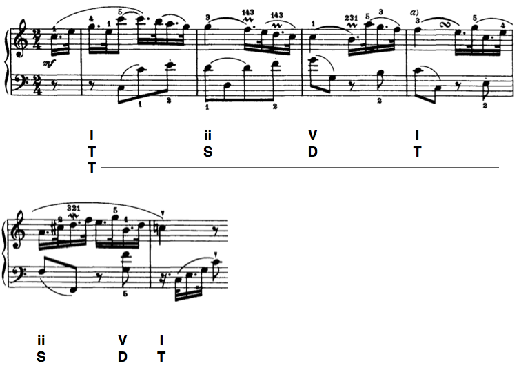

Analyzing harmony in a piece or passage of music involves more than labeling chords. Even the most basic analysis also involves *interpreting* the way that specific chords and progressions function within the context of a phrase. Ultimately, no analysis is complete until individual musical elements are interpreted in light of the work as a whole and the historical setting in which the piece occurs. But this resource simply walks through the steps of performing a basic harmonic analysis, interpreting each chord and chord progression in light of the musical phrase in which it occurs.

The first step in a harmonic analysis is to *identify phrases*. For the most part, that means beginning by identifying [*cadences*](cadenceTypes.html). However, not every type of phrase ends with a cadence, so sensitivity to theme types is important. In classical isntrumental music, that means listening for [period- and sentence-like structures](classicalThemes.html). In classical or romantic music with text, that means listening in particular for the ends of poetic lines and melodic phrases.

Once you have identified the musical phrases, it can be helpful to perform a thoroughbass reduction (bass line with figures above) for each phrase. Below the score/thoroughbass line, write the appropriate **T/S/D** label for each chord, or an uninterpreted functional bass symbol for each chord (**T1 T3 S4** etc.). [This handout](Graphics/Handouts/HarmoniesByBassScaleDegree.pdf) can help you determine the functions of chords in the thoroughbass reduction.

Next identify the general harmonic structure of each phrase. Typical phrases in classical music will do one of the following:

- prolong tonic without a cadence (a classical *presentation* phrase, for example)  
- progress toward an authentic cadence (ending with **D5 T1** or **V(7) I**)  
- progress toward a half cadence (ending with **D5** or **V(7)**)

If the phrase prolongs tonic, label the *entire* phrase **T–––.**

If the phrase ends with a cadence, identify the *cadential progression*. This includes the last chord of the tonic zone, optionally followed by a subdominant chord or zone (most often a single chord), and a required dominant zone (most often a single chord or compound cadence formula). Half-cadence phrases end there. Authentic-cadence phrases continue on to a final tonic zone (usually a singe chord). The **(S) D T** of the cadential progression will always stand on its own as a functional progression. The **T———** denoting tonic prolongation should stop at the last tonic chord before the final **(S) D T.**

Once the cadential progression is identified, everything before it should be analyzed as tonic prolongation. Whether it is contrapuntal prolongation, a subsidiary progression, or a combination of the two, it will be labeled **T–––.**

Following is an excerpt from the opening of Haydn's Piano Sonata in C Major, Hob. HVI:21, I. Chords are labeled with Roman numerals and a **T/S/D** functional label for each chord. The tonic prolongation is shown below that with a T followed by a line for the duration of the tonic zone. The cadential progression is comprised of the last tonic chord (m. 4) through to the **PAC** in m. 6.

