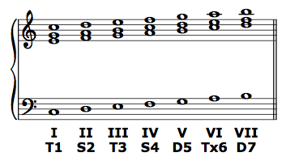
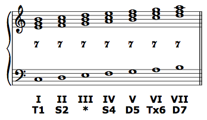

{{ page.title }}
================

*Harmonic syntax* concerns the norms or principles according to which harmonies (chords) are placed into meaningful successions. In Western classical music (pop/rock harmony is covered separately), harmonic syntax is closely tied to phrase structure. Harmony is not the only musical characteristic that contributes to the building of musical phrases. However, certain chords and chord progressions tend to appear in beginnings, middles, and ends of phrases. Thus the *function* of a chord concerns not only the notes that belong to it and which chords tend to precede and follow it, but where it tends to be employed in the course of a musical phrase.

You may already be familiar with one method of studying harmonic syntax, a *root-oriented* system that labels triads and seventh chords according to the scale degree of the root using Roman numerals. We will use these from time to time (and almost exclusively in our study of pop/rock music). However, for classical music, especially keyboard music of composers like Mozart, Haydn, Beethoven, and their contemporaries, we will use another system called *functional bass*.

The details of functional bass theory were largely put together in the last decade or so by Ian Quinn (Yale University). However, the system is not entirely new. It is based on older theories of harmony from figures like Jean-Phillipe Rameau, Hugo Riemann, and Allen McHose. The theory is based on five fundamental principles:

- Chords are collections of scale degrees.  
- Each scale degree has its own tendencies.  
- The collective tendencies of a chord's scale degrees in combination is the chord's function.
- The member of the chord in the bass (rather than the root) is the privileged member of the chord—that is, the chord member that determines, predicts, and/or encapsulates the general function of the chord more than the others.  
- Scale-degree tendencies in classical tonal music tend to group together into three broad functional categories, traditionally called *tonic* (T), *subdominant* (S), and *dominant* (D).

The syntactic properties of these functions will be covered elsewhere. What follows simply explains how to determine the function of a chord and provide a basic, uninterpreted *functional bass* label to a triad or seventh chord.

## Finding the function of a chord ##

Each of the three harmonic functions—*tonic* (T), *subdominant* (S), and *dominant* (D)—have characteristic scale degrees. Tonic's characteristic scale degrees are 1, 3, 5, 6, and 7. Subdominant's characteristic scale degrees are 1, 2, 3, 4, and 6. Dominant's characteristic scale degrees are 2, 4, 5, 6, and 7.

Quinn (in a manner similar to Daniel Harrison) further distinguishes these scale degrees, using the categories of functional *triggers*, functional *associates*, and functional *dissonances*. These categories differentiate between scale degrees more or less characteristic of a function, and they help us understand the functional properties of chords whose scale degrees belong to more than one function, as well as how certain notes behave within a chord.

| function 	| triggers 	| associates 	| dissonances 	|
| :-: | :- | :- | :- |
| **T**	| 1 and 3	| 5 and 6	| 5 (if 6 is also present) and 7
| **S**	| 4 and 6	| 1 and 2	| 1 (if 2 is also present) and 3
| **D**	| 5 and 7	| 2	| 4 and 6

In terms of moveable-*do* solfège:

| function 	| triggers 	| associates 	| dissonances 	|
| :-: | :- | :- | :- |
| **T**	| *do* and *mi*/*me*	| *sol* and *la*/*le*	| *sol* (if *la*/*le* is also present) and *ti*/*te*
| **S**	| *fa* and *la*/*le*	| *do* and *re*	| *do* (if *re* is also present) and *mi*/*me*
| **D**	| *sol* and *ti*/*te*	| *re*	| *fa* and *la*/*le*

To determine the function of a chord, find the function that includes all the scale degrees of a chord (irrespective of chromatic alterations). If more than one function contains all the scale degrees, take the function with the most triggers in the chord.

There is one exception to this (for now): a chord with scale degrees 6, 1, and 3 is a special kind of tonic chord, called a *destabilized tonic*. Quinn uses the special functional label is **Tx**, rather than simply **T**, for this chord.

If you are already familiar with Roman numerals, you can think of I, III triads belonging to **T**, VI belonging to **Tx**, II and IV belonging to **S**, and V and VII belonging to **D**. Despite this expediency for triads, do not ignore the more detailed concepts above, which will help you analyze passages with more complicated harmonies.

*Note that because the III7 chord's scale-degrees do not wholly belong to any of the three functions, it can behave similar to **T** and **D** chords, depending on context. It is a rare chord in its diatonic form.*

[This handout](Graphics/Handouts/HarmoniesByBassScaleDegree.pdf) will help you determine the function of a chord from the bass scale degree and/or the Roman numeral.

## Labeling chords ##

A chord's *uninterpreted* functional bass label is its function (T, S, D, or Tx) followed by the Arabic numeral for the scale degree of its bass note. A tonic chord with *do* in the bass is **T1**. A dominant chord with *ti* in the bass is **D7**. If the bass note is chromatically altered, use a **+** or **–** to denote raised or lowered (*la* and *ti* in minor do not count, since *le*, *la*, *te*, and *ti* all belong to minor), and if there is a chromatically altered note anywhere in the chord, put the functional bass symbol inside square brackets: **[S6]**, **[S+4]**, **[T–7]**, etc. (See [Chromatically altered subdominant chords](alteredSubdominants.html), [Applied chords](appliedChords.html), and [Modal mixture](modalMixture.html) for more information on common chromatically altered chords.)
)

See the resource on [harmonic syntax](harmonicSyntax.html) for *interpreted* functional bass analysis.

