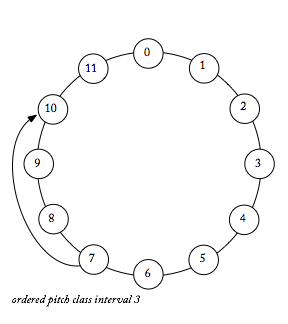
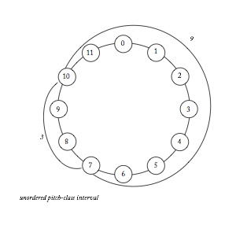

{{ page.title }}
================

Because intervals are dependent upon the pitches that create them, the consonance and dissonance of intervals in tonal music is determined by tonality itself. Imagine the interval create by G and B-flat, a minor third. In the context of G minor, this is a consonant interval. Respelled as G and A-sharp, it creates a dissonant augmented second. From a tonal perspective, the two intervals are different even though they are the same in isolation.

##Pitch interval##
When analyzing post-tonal music, we will often want to assert that similarity, especially when assumming the enharmonic equivalence of pitches. For us, the intervals G-B-flat and G-A-sharp *are* the same.

Pitch intervals are the distance between *pitches* as measured in half steps. Thus, the interval from G4 to A-sharp5 = +15. Think of it like this: if you are G4, how many half steps do you need to move to get to A-sharp5? You’d need to move up 15.

##Pitch-class intervals##
Pitch-class intervals are the distance between *pitch classes* as measured in semitones. Returning to our G4-A-sharp5 interval, we are now interested just in the pitch classes G and A-sharp. To go from G to A-sharp in pitch-class terms, we just have to move up 3.

##Ordering##
These intervals can be calculated with respect to their *order* (G4 to A-sharp5 is not the same as A-sharp5 to G4) or without worrying about order (G4 to A-sharp5 is the same as A-sharp5 to G4).

Ordered intervals should always have a “+” or “-” sign appended to them, representing the direction we have to travel. The ordered pitch interval from G4 to B-flat5 is +15, but the ordered pitch interval from A-sharp5 to G4 is -15. Ordered pitch-class intervals are measured going around the “clock” in clockwise fashion. Thus, from G to A-sharp = 3, and from A-sharp to G = 9.

**Ordered Pitch Interval**

**Ordered Pitch-Class Interval**

Unordered intervals represent the *shortest distance* between two pitches or pitch classes, without any reference to the order they are in. To determine the unordered interval, simply find the shortest distance between two pitches. The unordered pitch interval from G4 to A-sharp5 is 15. The unordered pitch-class interval from G to A-sharp is 3.

**Unordered Pitch Interval**

**Unordered Pitch-Class Interval (Interval Class)**

##Summary##

Using various combinations of pitch interval, pitch-class interval, ordered, and unordered, we arrive at four different conceptions of interval. To wrap your mind around each of these and begin to understand their various analytical uses, think of them on a sliding scale of most concrete—the ordered pitch interval—to most abstract—the unordered pitch-class interval.
