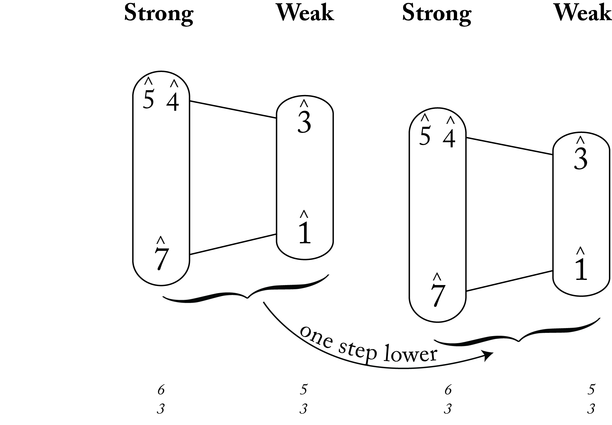
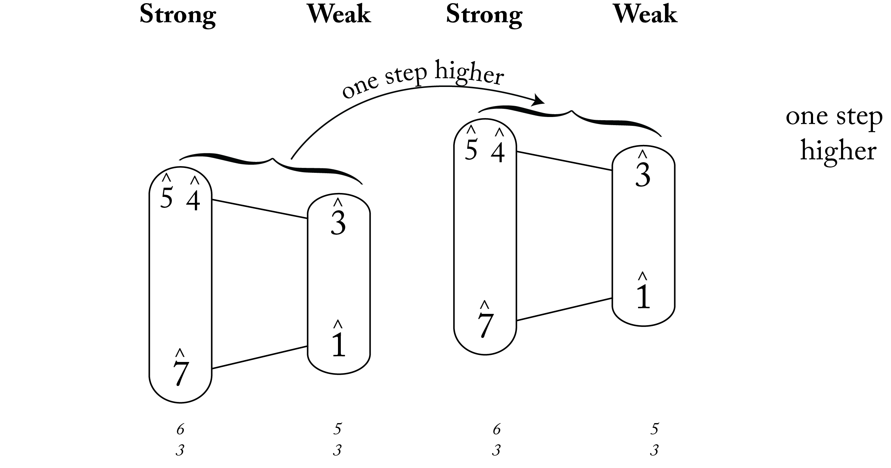

The three schema below were described first by the eighteenth-century theorist Joseph Riepel. They are ["continuation patterns"](http://www.mtosmt.org/issues/mto.05.11.2/mto.05.11.2.eckert.html), often found after the first double bar in a minuet. The "Fonte" and "Monte" are both sequential, the "Ponte" is a way of extending a harmony.

# Fonte #

A *Fonte* (It. for "fountain" or "well"—think *going down*) is a common pattern to begin the *contrasting middle* of a small ternary form. In other words, it follows the double-bar in a minuet, minuet trio, or rounded-binary theme. A Fonte is a *model/sequence* schema: a two-bar pattern is immediately repeated one step lower than the original.

Harmonically, the first two-bar unit (the *model*) contains two chords, one per bar: an applied dominant chord, and the tonicized chord to which the applied dominant points. The most common chord pattern for the Fonte's model is **D7/II T1/II** *of the home key*, with the **D7** being a chord of the sixth and the **T1** being a chord of the fifth. (Other "inversions" are possible, such as **D4/II T3/II**.) When the model composes out **D7/II II**, the sequence will transpose it down to tonic: **D7 T1** *of the home key*.

As an example, the functional-bass analysis of a typical Fonte in a small ternary whose home key is G major looks like:

![Haydn, Piano Sonata in G Major, Hob.XVI:27, III., mm. 9–12.][Haydn27]

Note the non-cadential progressions, **D7–T1**. Normally such progressions would need to be interpreted as prolonging a tonal function (i.e., tonic function), which would be difficult to interpret here. Schemata often contain such progressions. Simply analyze the chords individually and label the schema, rather than trying to interpret these progressions as prolongational. (Indeed, they are not.)

A common model for a minuet containing a Fonte is as follows:

||: EXPOSITION ending with V:PAC :||: Fonte - phrase ending with I:HC – RECAPITULATION :||

The Fonte is a quick and easy way for a composer to transition from the key of the dominant (where a major-key minuet's exposition cadences immediately before the double-bar) to the key of the tonic. It will usually be followed by a phrase that stands on or moves to the dominant of the home key. The half cadence or *dominant arrival* at the end of that phrase will prepare for the return to the opening material in the home key, the *recapitulation* of the minuet or small ternary.

# Monte #

A *Monte* (It. for "mountain"—think *going up*) functions similarly to a Fonte. It typically occurs as part of the *contrasting middle* section of a minuet or other small ternary, it is a model/sequence schema, and it involves an applied chord resolving to a tonicized chord—typically a **D7 T1** pattern. The difference is that where a Fonte goes *down* (**D7/II T1/II D7 T1**), a Monte goes *up* (**D7/IV T1/IV D7/V T1/V**). And where a Fonte is almost exclusively four bars long (one model followed by one transposed repetition), a Monte sometimes extends to six or more bars (one model followed by one *or more* transposed repetitions).

# Ponte #

A *Ponte* (It. for "bridge") was another common schema for the *contrasting middle* of a minuet. Unlike the Fonte and the Monte, the Ponte need not be a model/sequence schema. It effects *delay* rather than *motion*. A Ponte typically functions like what Caplin calls *standing on the dominant*. The exposition of the major-key minuet will end with a PAC in the dominant of the home key. When a Ponte follows that cadence, it holds onto that **T1/V**, heightens tension melodically, and often adds a seventh to the chord (making it D5 of the home key). A passage built on a Ponte does not have a cadence, since there is no harmonic progression, but instead ends with a punctuated dominant chord in the home key, which Caplin calls a *dominant arrival* rather than a half cadence. This dominant arrival prepares the return of the home key and the opening basic idea that come at the minuet's recapitulation.

# References #

Caplin, William. *Classical Form*. Oxford University Press, 2000.

Gjerdingen, Robert O. *Music in the Galant Style*. Oxford University Press, 2007.

[Haydn27]: Graphics/Schemata/Haydn27fonteAnnotated.png width="75%"